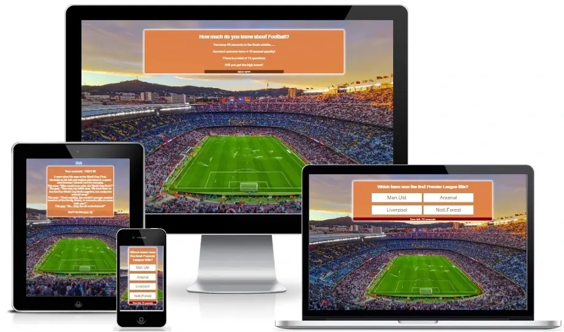
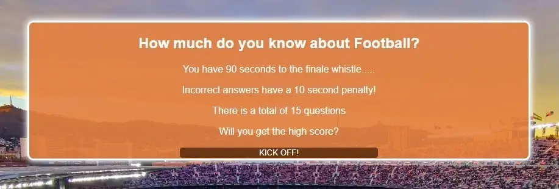
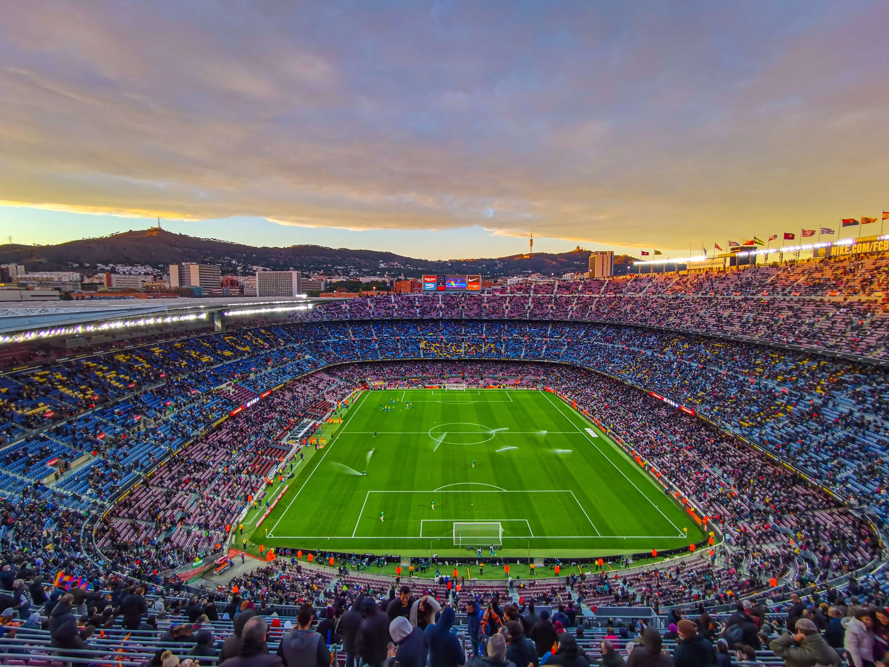
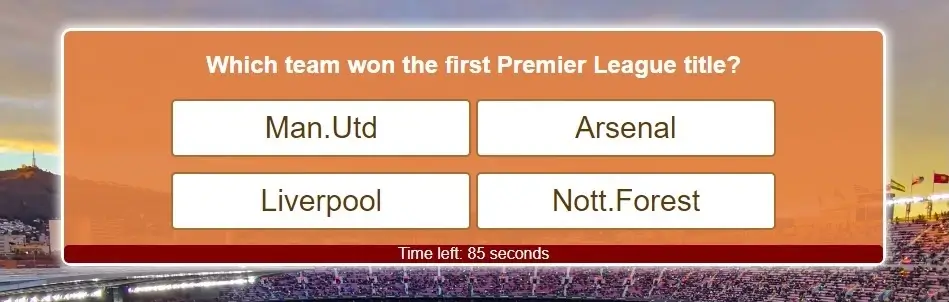
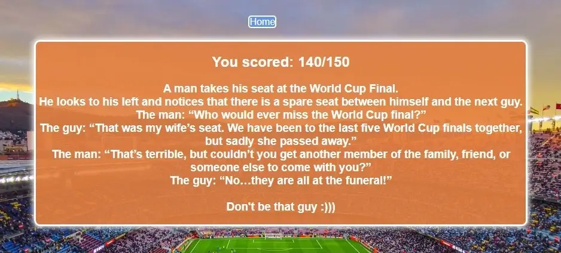

# Football Quiz

This website can offer an interactive quiz game for football fans. You will have a limited time to answer all football questions and every wrong answer will be punished with a red card. If you get a high score then you'll be awarded the best football fans joke I've ever heard.
It is designed to be responsive and accessible on a range of devices, making it easy to navigate for all users.

[View the live project here.](https://xhorxh.github.io/Football-Quiz/)

## Features

The features in this game are the countdown time limit of 90 seconds for 11 questions, which is shown all the time at the bottom of the play area, and the 10 seconds penalty for wrong questions. When the quiz is over, the screen will display the result with some quotes depending on the score reached and the home button for those who want to try it again.

### Existing Features

- __Start section__

  - This section shows the users the rules of the quiz game and a "Kick-Off" button to allow them to start the quiz.
  - It is fully responsive and has the same layout as the play area, as well as the result section.

- __The background image__
  - The background image includes a photograph of the biggest stadium in Europe to give the users the feeling of a real football game.

- __Play area section__

  - The questions will be displayed in this quiz box with four options and at the bottom of this box starts automatically the countdown timer.
  - Like other sections on this website, the layout is almost the same and the option buttons have a hover effect and a pointer cursor.

- __Result section__

  - This section will be displayed immediately after the countdown timer is over or all the questions have been answered.
  - Here will be shown the final result and depending on this result also different quotes, and a home button to start over the quiz.

### Features Left to Implement
- I would like to randomize the questions and the answers as well.
- Add more questions from different categories of football.
- Implement some animations in the result section.

  ## _**Design**_
  * ### _Colors:_

    * The quiz box is the same in all sections and has a background-color of orange (rgba(228, 127, 64, 0.9)) with 90% opacity.
    * The questions are written in white color and the answers are written in deeper orange color (rgb(151, 62, 6)) on a white background to have the best visibility.
    * I choose these colors because I am a big fan of holland football and these are the color of the national Holland football team.
  * ### _Font:_
    * I would like to keep it simple here with just an Open Serif font from [Google Fonts](https://fonts.google.com/specimen/Open+Sans?query=open).

### Validator Testing

- HTML:
  - No errors were returned when passing through the official [W3C validator]()
- CSS:
  - No errors were found when passing through the official [(Jigsaw) validator]()
- JavaScript:
  - No errors were returned  when validating in [(JSHint) validator]()
-LightHouse:
  -  Lighthouse chechk results:

## Deployment
### GitHub Pages

The project was deployed to GitHub Pages using the following steps...
1. Log in to GitHub and locate the [GitHub Repository](https://github.com/Xhorxh/Football-Quiz)
2. At the top of the Repository (not the top of the page), locate the "Settings" button on the menu.
3. Scroll down the Settings page until you locate the "GitHub Pages" Section.
4. Under "Source", click the dropdown called "None" and select "Master Branch".
5. The page will automatically refresh.
6. Scroll back down through the page to locate the now published site [link](https://xhorxh.github.io/Football-Quiz/) in the "GitHub Pages" section.

## Credits

### Content

-   The questions are written from information in [Wikipedia](https://en.wikipedia.org/wiki/Main_Page)
-   The last joke is from [Bleacherreport](https://bleacherreport.com/).         

### Media
-   The background image on this website is downloaded from [Pexels](https://www.pexels.com/).

### Acknowledgements
-   My Mentor for continuous helpful feedback.
-   Tutor support at Code Institute for their support.
