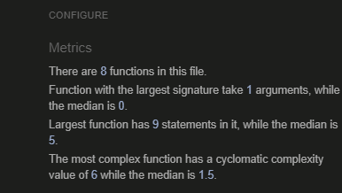

# Football Quiz

This website can offer an interactive quiz game for football fans. You will have a limited time to answer all football questions and every wrong answer will be punished with a red card. If you get a high score then you'll be awarded the best football fans joke I've ever heard.
It is designed to be responsive and accessible on a range of devices, making it easy to navigate for all users.

[View the live project here.](https://xhorxh.github.io/Football-Quiz/)


## Features

The features in this game are the countdown time limit of 90 seconds for 11 questions, which is shown all the time at the bottom of the play area, and the 10 seconds penalty for wrong questions. When the quiz is over, the screen will display the result with some quotes depending on the score reached and the home button for those who want to try it again.

### Existing Features

- __Start section__

  - This section shows the users the rules of the quiz game and a "Kick-Off" button to allow them to start the quiz.
  - It is fully responsive and has the same layout as the play area, as well as the result section.


- __The background image__
  - The background image includes a photograph of the biggest stadium in Europe to give the users the feeling of a real football game.


- __Play area section__

  - The questions will be displayed in this quiz box with four options and at the bottom of this box starts automatically the countdown timer.
  - Like other sections on this website, the layout is almost the same and the option buttons have a hover effect and a pointer cursor.


- __Result section__

  - This section will be displayed immediately after the countdown timer is over or all the questions have been answered.
  - Here will be shown the final result and depending on this result also different quotes, and a home button to start over the quiz.


### Features Left to Implement
- I would like to randomize the questions and the answers as well.
- Add more questions from different categories of football.
- Implement some animations in the result section.

  ## _**Design**_
  * ### _Colors:_

    * The quiz box is the same in all sections and has a background-color of orange (rgba(228, 127, 64, 0.9)) with 90% opacity.
    * The questions are written in white color and the answers are written in deeper orange color (rgb(151, 62, 6)) on a white background to have the best visibility.
    * I choose these colors because I am a big fan of holland football and these are the color of the national Holland football team.
  * ### _Font:_
    * I would like to keep it simple here with just an Open Serif font from [Google Fonts](https://fonts.google.com/specimen/Open+Sans?query=open).

## Testing 
-   I found some warnings in JSHint report such as "'let' is available in ES6" (use 'esversion: 6'), and "One unused variable", which is not. After reading the documentation, I added in js script as a comment "exported", which is a directive for telling JSHint about global variables that are defined in the current file but used elsewhere.
- Also for the let statement, I added in js script as a comment "jshint esversion: 6 ". And now in my JSHint report are no warnings.
- I have been working all the time with my desktop text editor (Atom) to avoid non-sense commits in Gitpod. That's why I've done all the commits mostly in one day (after the project was finished). I am not really sure if this is a good practice, and if not I'll make sure to use only VS editor in Gitpod for the next projects from start to finish.

### Validator Testing

- HTML:
  - No errors were returned when passing through the official [W3C validator](https://validator.w3.org/nu/?doc=https%3A%2F%2Fxhorxh.github.io%2FFootball-Quiz%2F)
- CSS:
  - No errors were found when passing through the official [(Jigsaw) validator](https://jigsaw.w3.org/css-validator/validator?uri=https%3A%2F%2Fxhorxh.github.io%2FFootball-Quiz%2F&profile=css3svg&usermedium=all&warning=1&vextwarning=&lang=en)
- JavaScript:
  - No errors were returned  when validating in [(JSHint) validator](https://jshint.com/)
  

  -  Lighthouse chechk results:


### Further Testing

-   The Website was tested on Google Chrome, Microsoft Edge, Mozilla Firefox, and Safari browsers.
-   I tested my website all the time while I was writing it(using developer tools in Chrome to check for errors and how the elements are displayed). I managed to put everything where I wanted to. The website is fully  responsive after lots of tests in [Responsinator](http://www.responsinator.com/?url=https%3A%2F%2Fxhorxh.github.io%2FFootball-Quiz%2F), developer tools, and other websites.
-   Friends and family members were asked to review the site to point out any bugs and/or user experience issues.

## Deployment

### GitHub Pages

The project was deployed to GitHub Pages using the following steps...
1. Log in to GitHub and locate the [GitHub Repository](https://github.com/Xhorxh/Football-Quiz)
2. At the top of the Repository (not the top of the page), locate the "Settings" button on the menu.
3. Scroll down the Settings page until you locate the "GitHub Pages" Section.
4. Under "Source", click the dropdown called "None" and select "Master Branch".
5. The page will automatically refresh.
6. Scroll back down through the page to locate the now published site [link](https://xhorxh.github.io/Football-Quiz/) in the "GitHub Pages" section.

### Forking the GitHub Repository

By forking the GitHub Repository we make a copy of the original repository on our GitHub account to view and/or make changes without affecting the original repository by using the following steps...

1. Log in to GitHub and locate the [GitHub Repository](https://github.com/Xhorxh/Football-Quiz)
2. At the top of the Repository (not top of page) just above the "Settings" Button on the menu, locate the "Fork" Button.
3. You should now have a copy of the original repository in your GitHub account.

### Making a Local Clone

1. Log in to GitHub and locate the [GitHub Repository](https://github.com/Xhorxh/Football-Quiz)
2. Under the repository name, click "Clone or download".
3. To clone the repository using HTTPS, under "Clone with HTTPS", copy the link.
4. Open Git Bash
5. Change the current working directory to the location where you want the cloned directory to be made.
6. Type `git clone`, and then paste the URL you copied in Step 3.

```
 $ git clone https://github.com/Xhorxh/Football-Quiz
```

7. Press Enter. Your local clone will be created.

```
$ git clone https://github.com/Xhorxh/Football-Quiz
> Cloning into `CI-Clone`...
> remote: Counting objects: 10, done.
> remote: Compressing objects: 100% (8/8), done.
> remove: Total 10 (delta 1), reused 10 (delta 1).
> Unpacking objects: 100% (10/10), done.
```

Click [Here](https://help.github.com/en/github/creating-cloning-and-archiving-repositories/cloning-a-repository#cloning-a-repository-to-github-desktop) to retrieve pictures for some of the buttons and more detailed explanations of the above process.
## Credits

### Content

-   The questions are written from information in [Wikipedia](https://en.wikipedia.org/wiki/Main_Page), and some ideas are from [Goal](https://www.goal.com/).
-   The last joke is from [Bleacherreport](https://bleacherreport.com/).   
-   I have followed many tutorials to understand better how to create this quiz game and the check answer function is from [Code Explained](https://www.codeexplained.dev/2018/10/create-multiple-choice-quiz-using-javascript.html).      


### Media
-   The background image on this website is downloaded from [Pexels](https://www.pexels.com/).


### Acknowledgements
-   My Mentor for continuous helpful feedback.
-   Tutor support at Code Institute for their support.
